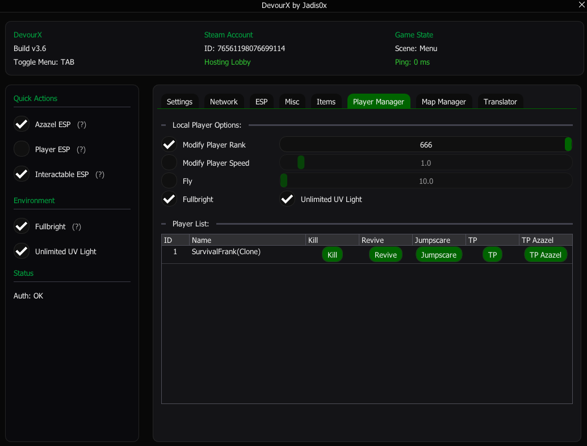
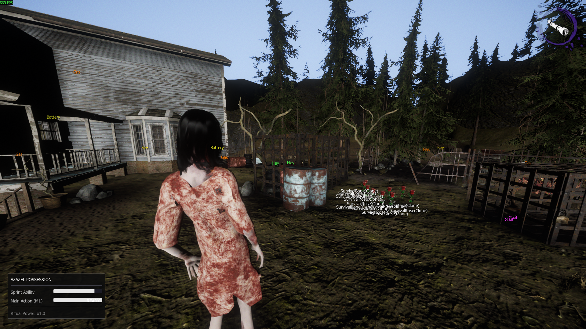
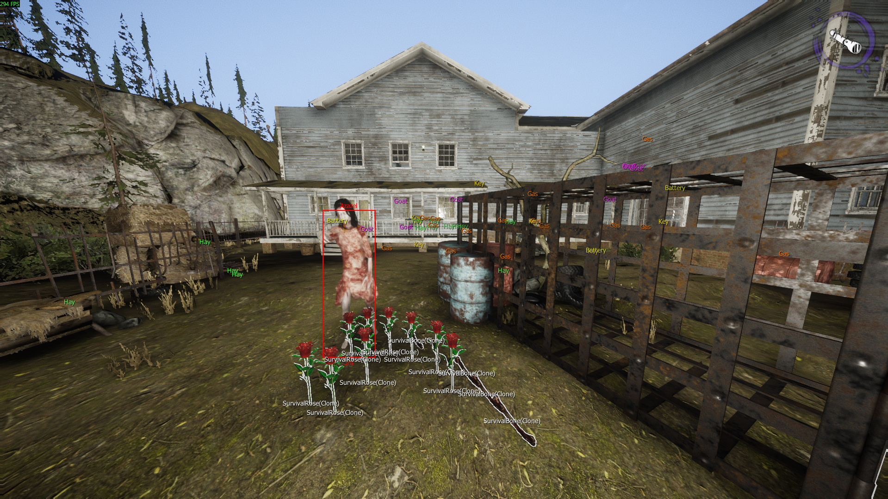

  
  

<h1 align="center">DevourModMenu</h1>

  <i>A native C++ mod menu for DEVOUR, built with <a href="https://github.com/Jadis0x/URKit">URKit.</a></i>

## About

DevourModMenu is the new version of the project previously known as DevourX.

The old Il2CppInspector scaffold-based system has been replaced with **URKit**, a custom C++ modding framework built for loading mods, accessing game classes, installing hooks, rendering ImGui menus, and handling updates more reliably.

The project is still being migrated to the new system. Some features from DevourX are not available yet and will be added back gradually as development continues.

## Current Status

DevourModMenu is currently in active development.

The main focus right now is:

* Improving stability
* Migrating existing features to URKit

Not every feature listed below is available in the current build yet.

## Features
* Fullbright
* ESP
* Unlimited UV Light
* UV Light Color Customization
* Speed Modifier
* Fly Mode
* Instant Win
* Item Spawner
* Disable Long Interactions
* Unlock Doors
* Unlock Robes
* Play as Azazel
* Bunny Hop
* Force Start
* Player Limit Modification
* Room Name Modification
* Walk in Lobby
* EXP Modifier
* Steam Name Modification
* SteamID Modification
* and more..

Some of these features are still being ported from the old DevourX version and may not be available yet.

## Planned Features

The following features are planned for future updates:

* Improved configuration system
* More stable game update compatibility

## Requirements

* Windows 10 or Windows 11, 64-bit
* A legitimate Steam copy of DEVOUR
* [Microsoft Visual C++ Redistributable — x64](https://www.techpowerup.com/download/visual-c-redistributable-runtime-package-all-in-one/)

## Showcase

  

  
  

## Access

DevourModMenu is currently a private project.

To request access:

1. Contact me on Discord before making a payment.
2. Support the project through Buy Me a Coffee.
3. After confirmation, access will be activated for your account.

Discord: `Jadis0x`

## Installation

## Troubleshooting

### The menu does not appear

Make sure that:

* Your account has been authorized.
* The mod files are inside the main DEVOUR directory.
* You launched the game through Steam.
* Microsoft Visual C++ Redistributable is installed.
* Windows Defender or another antivirus did not quarantine the files.
* You are using the latest version.

DLL-based mods may occasionally be detected as false positives because they load into the game process and install runtime hooks.

Only use files obtained directly from the official DevourModMenu release.

## Disclaimer

DevourModMenu is intended for private modding, development, and research purposes.

Do not use it to harass players or ruin public matches. You are responsible for how you use the software.
