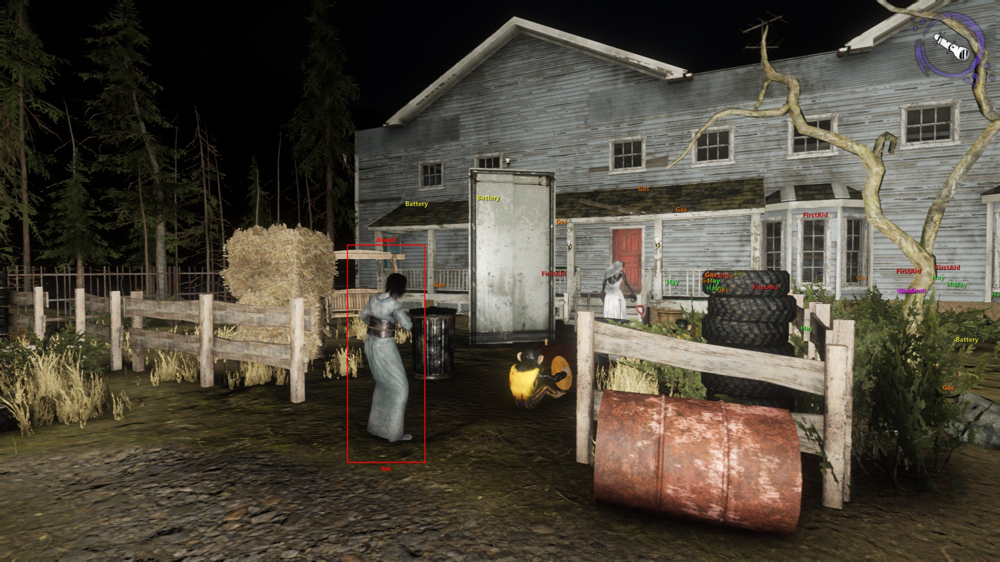
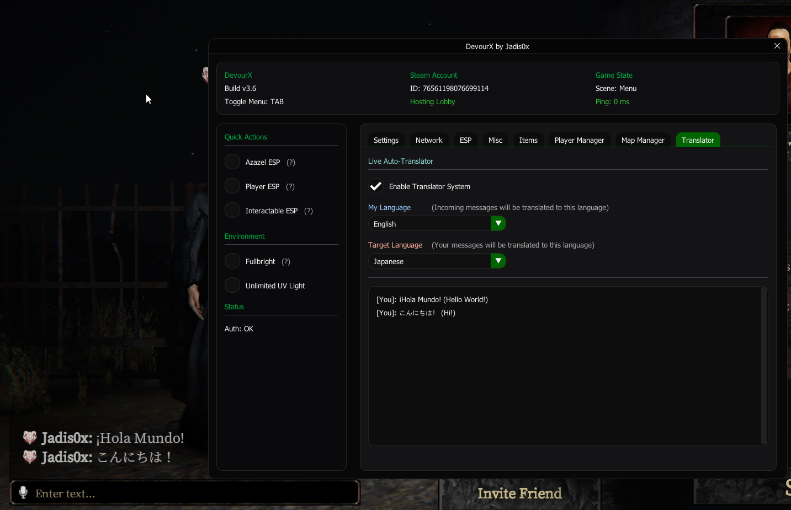
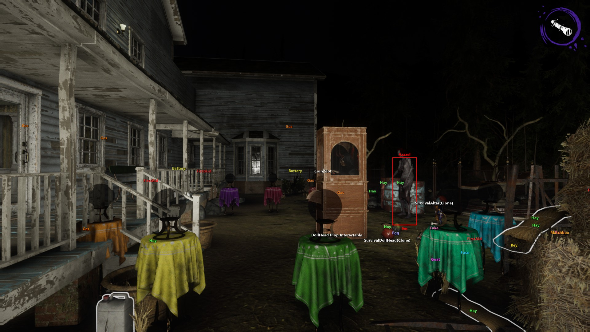

  
  

<h1 align="center">👻 DevourX</h1>

<i>The ultimate internal mod menu for the co-op horror game Devour.</i>

### Features

**Visuals & ESP**
* Fullbright
* Advanced ESP
* Unlimited UV Light & Color Customizer

**Gameplay**
* Speed Hacks & Fly Mode
* Instant Win & Item Spawner
* Disable Long Interactions
* Unlock All Doors/Robes
* Auto-Calm (Automatically calms Azazel when nearby)
* Play as Azazel
* BHOP
* Live Chat Translator (powered by Google API)

**Lobby & Steam**
* Force Start Lobbies
* Bypass Player Limits
* Change Room Name
* SteamID & Name Hook Spoofing
* EXP Modifier
* Walk In Lobby

---

### Requirements
* Windows 10/11 (64-bit)
* A legitimate copy of Devour (Steam or other supported platforms)
* [Microsoft Visual C++ Redistributable (x64)](https://www.techpowerup.com/download/visual-c-redistributable-runtime-package-all-in-one/)

---

### Showcase

  

  
  
  

**Controlling Azazel:** 

---

### Get Access & Support
DevourX is currently a private project. To gain access, you need to follow these steps:

1. **Contact Me First:** Reach out to me directly via Discord before doing anything else.
   - Discord: Jadis0x
3. **Support the Project:** Make a small donation via Buy Me a Coffee to help maintain and update the menu.
4. **Activation:** Once confirmed, I will grant your account/profile direct access to the project. *(No files will be sent manually).*

---

### Quick Start Installation

1. **Get Authorized:** Make sure you have contacted me and received access authorization.
2. **Locate Game Folder:** Find your Devour directory. (Default: `C:\Program Files (x86)\Steam\steamapps\common\Devour`)
3. **Extract & Copy:** Place the authorized `version.dll` and `localization/` folder directly into the main game directory alongside `Devour.exe`.
4. **Launch:** Start the game normally. DevourX will hook automatically.
5. **Play:** Press `TAB` in-game to toggle the menu.

---

### Language Support
DevourX supports multiple languages including English, Turkish, Spanish, German, French, Korean, Simplified Chinese, Ukrainian, Russian, and Thai. The menu will prompt for your preference on first launch.

**Want to add your own custom language?**
1. Duplicate `localization/en-US.json` and rename it (e.g., `es-ES.json`).
2. Translate the values (keep JSON keys and `%s` / `%d` intact).
3. Add your language name to the `languages` array at the top of the file.
4. Set it as default in `localization/config.json` to test your changes in-game.

---

### ⚠️ Troubleshooting
**Menu not showing up?** Windows Defender or your antivirus might flag `version.dll` (a common false positive for injected DLLs). Simply restore the file from quarantine and add it to your exclusions, then relaunch the game.

### Uninstalling
Simply close Devour and delete `version.dll` from your game folder.

---
*Disclaimer: This project is for educational and research purposes. Use responsibly and avoid ruining public lobbies.*
